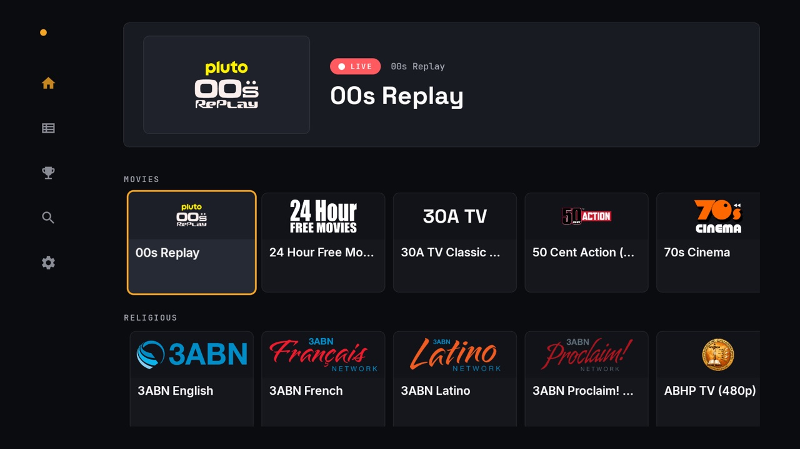
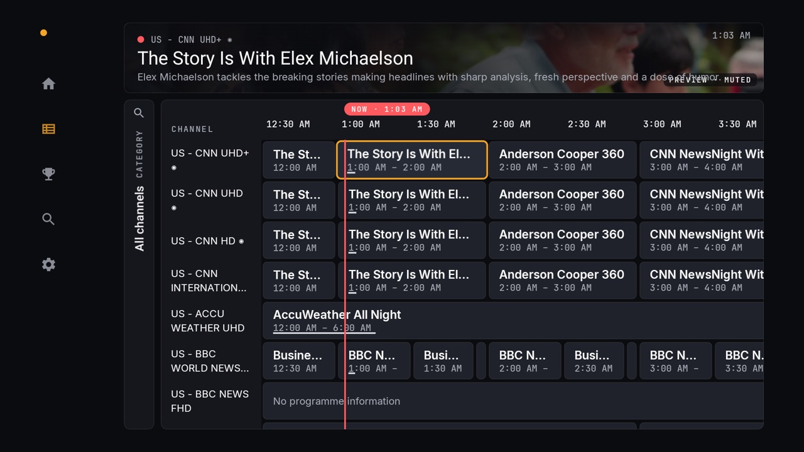
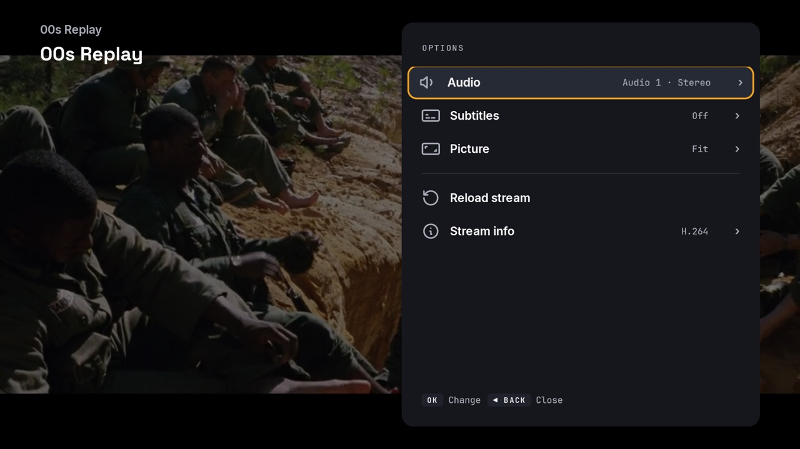
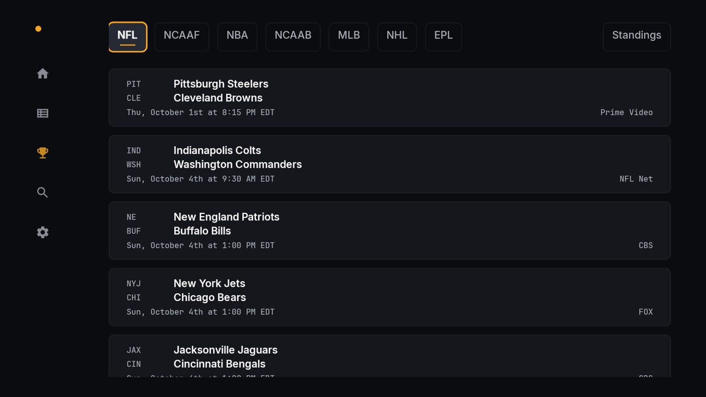
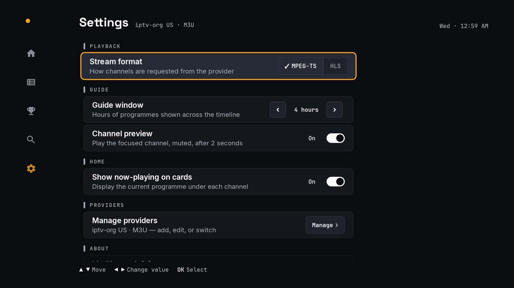

# LiveWire

[](https://github.com/namillis/LiveWireTV/actions/workflows/ci.yml)
[](https://github.com/namillis/LiveWireTV/releases/latest)
[](LICENSE)

LiveWire is an IPTV player for Android TV, Google TV and Fire TV. You bring
your own Xtream Codes or M3U provider. There's no account and no LiveWire
server. The app talks to your provider directly, and your login is stored only
on the device.



| Guide | Player options |
|---|---|
|  |  |
| **Sports** | **Settings** |
|  |  |

## Features

- **Home.** A hero band shows what's on the focused channel now and next,
  with rails of channels grouped by your provider's categories.
- **Guide.** A programme grid with a red now-line. You can filter it by
  category or keyword, and it keeps your place when you come back from a
  channel. After 2 seconds, the focused channel plays muted in the band above
  the grid that shows the programme details. A downloaded guide is reused for up to 3 hours, so reopening the
  Guide in that time doesn't download it again.
- **Player.** Up and Down change channel. Left opens the channel list, and
  Right opens Options: audio track, subtitles, picture mode (fit, fill, zoom),
  reload and stream info.
- **Search.** Results are grouped into channels, programmes that are on now
  or later, and games. When the field is empty it shows your recent searches
  and the channels you watched last.
- **Sports.** Scores and schedules from ESPN for the NFL, college football, the
  NBA, men's college basketball, MLB, the NHL and the Premier League. Choosing
  a game opens a picker with the channels most likely to carry it, checked
  against your guide.
- **Providers.** Add more than one Xtream or M3U provider and switch between
  them. Placeholder rows that some providers use as category headers
  (`##### NEWS #####`) are hidden.
- **Settings.** Stream format (MPEG-TS or HLS), guide window, channel preview,
  and now-playing text on Home cards.

Everything works with a TV remote's D-pad. On phones and touch TVs, taps work too.

## Install

LiveWire isn't in the Play Store or the Amazon Appstore. Download the APK from
the [latest release](https://github.com/namillis/LiveWireTV/releases/latest)
and sideload it.

1. **Allow installs from unknown sources** for the app you'll install with.
   Menu names vary by device.
   - **Fire TV:** Settings → My Fire TV → Developer options → Install unknown
     apps. If Developer options is hidden, open Settings → My Fire TV → About
     and select the device name seven times.
   - **Google TV / Android TV:** Settings → Apps → Security & restrictions →
     Unknown sources, then allow the app you'll use to install LiveWire
     (for example Downloader or your file manager).
2. **Install the APK** in one of these ways:
   - **Downloader app** (Fire TV and Google TV), free from the Amazon
     Appstore or Google Play: enter
     `https://github.com/namillis/LiveWireTV/releases/latest`, scroll to *Assets*, and
     select the `livewire-<version>.apk` link.
   - **adb** from a computer on the same network. Turn on network or ADB
     debugging in Developer options, and find the TV's IP address under its
     network settings:
     ```bash
     adb connect <tv-ip>:5555
     adb install -r livewire-<version>.apk
     ```
   - **A file manager**, from a USB drive or network share.
3. **Updating:** install the new APK over the old one. Every release is signed
   with the same key, so your providers and settings are kept. The app doesn't
   check for updates yet.

## Setup

On first launch LiveWire asks for a provider. Your IPTV provider gives you
these details when you sign up. You can add more later under
Settings → Manage providers.

- **Xtream Codes:** server address, username and password. The guide is
  loaded from the same server.
- **M3U playlist:** the playlist URL, and optionally a guide (XMLTV) URL. If
  you leave the guide URL empty, LiveWire uses the one advertised in the
  playlist header (`url-tvg` or `x-tvg-url`), if there is one. Movie and
  series entries in a playlist are skipped; LiveWire plays live TV only.

Plain `http://` providers are allowed, because many IPTV servers don't offer
HTTPS. Traffic to those servers, including your login, is not encrypted.

If channels won't play, try switching Stream format between MPEG-TS and HLS
in Settings.

## Privacy

- Provider logins are stored on the device with Android's encrypted shared
  preferences. The key never leaves the device.
- Backups and device-to-device transfer are turned off, so app data isn't
  copied to Google Drive or a new device.
- LiveWire connects to your provider (channels, guide, streams), to ESPN's
  public scoreboard API for the Sports screen, and to wherever your provider's
  channel list says the channel logos are hosted. Nothing else.
- There are no analytics, ads or crash reporting. The full source is in this
  repository if you want to check.

## Requirements

- Android 6.0 (API 23) or later.
- Built for TVs and TV sticks. It also installs on phones and tablets.

## Build from source

You need JDK 17 and the Android SDK. Gradle comes with the wrapper, and the
Android Gradle Plugin, SDK levels and library versions are set in
`app/build.gradle.kts` and `gradle/libs.versions.toml`.

```bash
./gradlew :app:assembleDebug          # debug APK in app/build/outputs/apk/debug/
./gradlew :app:testDebugUnitTest      # unit tests
./gradlew :app:lintDebug              # Android lint
./gradlew :app:assembleRelease        # minified release APK
```

The debug build's package is `com.livewire.tv.debug`, so it installs next to a
release build without replacing it. To launch it from adb:

```bash
adb shell am start -n com.livewire.tv.debug/com.livewire.tv.MainActivity
```

If your default `java` isn't 17, point Gradle at a JDK 17 without editing
tracked files, either with `org.gradle.java.home` in
`~/.gradle/gradle.properties` or by exporting `JAVA_HOME`.

CI runs the unit tests, lint and a debug build on every pull request and
every push to `main`.

## Project layout

```
app/src/main/kotlin/com/livewire/tv/
  core/player/     PlaybackEngine interface and its ExoPlayer implementation
  core/net/        Response stream helpers (gzip handling)
  di/              Hilt modules
  navigation/      Nav host and the left navigation drawer
  ui/              Theme, shared surfaces and text fields, touch support
  feature/
    onboarding/    First-run provider setup
    providers/     Xtream and M3U clients, provider storage, Providers screen
    epg/           Guide screen, XMLTV parsing and the guide cache
    home/          Home screen
    player/        Player screen, overlay, Options and channel list panels
    search/        Search and search history
    sports/        ESPN scoreboard and the channel picker
    settings/      Settings screen and stored preferences
scripts/measure.sh Memory, start-up and APK size measurements on a real device
```

The player UI talks to `PlaybackEngine`, not to ExoPlayer directly, so another
playback engine can be added later without changing the screens.

## Releasing

Pushing a tag like `v0.1.4` builds a signed release APK and publishes it as a
GitHub Release. See [docs/RELEASING.md](docs/RELEASING.md) for the steps,
version numbering and signing setup.

## Credits

- Playback by [AndroidX Media3 / ExoPlayer](https://github.com/androidx/media).
- Fonts: [Inter](https://github.com/rsms/inter),
  [Space Grotesk](https://github.com/floriankarsten/space-grotesk) and
  [JetBrains Mono](https://github.com/JetBrains/JetBrainsMono), all under the
  SIL Open Font License. They're bundled, trimmed to Latin characters, because
  many TV devices can't download fonts. Licence texts and source versions are
  in [third_party/fonts/](third_party/fonts/).
- Sports data comes from ESPN's public site API. LiveWire isn't affiliated
  with or endorsed by ESPN.

## Disclaimer

LiveWire is a player only. It doesn't provide, host or link to any channels or
streams. You need your own provider, and you're responsible for making sure
you have the right to watch what it serves.

## License

[MIT](LICENSE)
